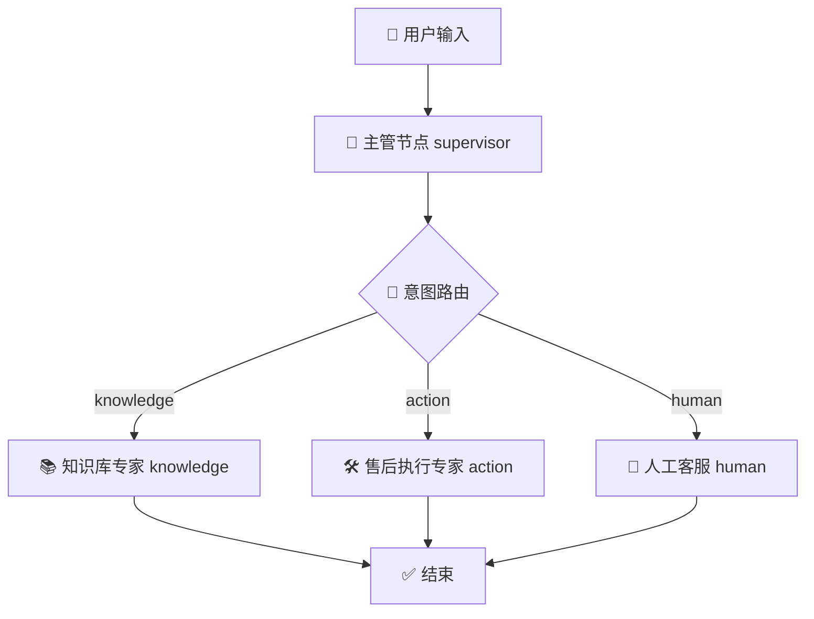

# 🤖 极客科技 · 数字员工 —— 基于 LangGraph 的多 Agent 智能客服系统

[](https://www.python.org/downloads/)
[](https://github.com/langchain-ai/langgraph)
[](https://ollama.com/)
[](https://streamlit.io/)
[](https://www.mysql.com/)
[](https://fastapi.tiangolo.com/)

## 📖 项目介绍

**Digital Employee（数字员工）** 是一个从零开始构建的**企业级多 Agent 智能客服系统**。它能够像真人客服一样：

- ✅ **理解用户意图** —— 自动区分“咨询政策”、“执行操作”和“转接人工”。
- ✅ **查询私有知识库** —— 基于 RAG 技术精准回答公司制度、产品说明等问题。
- ✅ **调用业务工具** —— 真实对接后端 API，查询订单、创建工单。
- ✅ **记住多轮对话** —— 对话状态持久化到 MySQL，重启服务不丢失。
- ✅ **人机协同转人工** —— 用户要求转人工时流程自动暂停，等待人工客服介入后恢复。

系统包含**面向用户的智能客服界面**和**功能完善的管理后台**，支持多用户会话隔离、知识库在线管理、对话记录查询等企业级特性。

---

## 🏗️ 系统架构

系统采用 **LangGraph** 实现 **Supervisor-Specialist（主管-专家）** 协作模式。所有 Agent 被封装为图中的节点，通过**条件边**动态路由，状态统一管理。



### 核心组件说明

| 组件 | 职责 | 技术实现 |
| :--- | :--- | :--- |
| **主管 (Supervisor)** | 分析对话历史，识别用户意图 (`knowledge`/`action`/`human`) | LLM + Prompt Engineering |
| **知识库专家 (Knowledge Agent)** | 从本地文档中检索答案，回答政策、说明类问题 | Ollama Embedding + ChromaDB (RAG) |
| **售后执行专家 (Action Agent)** | 处理需操作的任务（查订单、建工单），自主决策调用工具 | Function Calling (LangChain Tools) + FastAPI 后端 |
| **人工客服 (Human Agent)** | 通过 `interrupt` 暂停流程，等待人工输入后恢复执行 | LangGraph `interrupt` + `Command(resume)` |
| **共享状态 (State)** | 存储对话历史、意图、最终回复等，实现跨节点上下文记忆 | `TypedDict` + `add_messages` |
| **对话持久化** | 多轮对话状态与历史记录持久化到 MySQL | LangGraph `MySQLSaver` + 自建 `conversation_history` 表 |

---

## ✨ 主要特性

- **🧠 智能意图识别**：基于本地 Ollama 模型（`qwen2.5:3b`）进行语义理解，告别生硬的关键词匹配。
- **📚 私有化 RAG 知识库**：文档向量化存储在 ChromaDB，支持 **PDF、Word、TXT、Markdown** 等多种格式，自适应分块策略。
- **🛠️ 工具调用能力**：售后 Agent 可调用 `query_order`、`create_ticket` 等工具，与真实 FastAPI 后端交互。
- **💬 强大的上下文记忆**：通过 LangGraph 的 `MySQLSaver` 实现状态持久化，服务重启后对话仍可无缝继续。
- **👥 多用户会话隔离**：基于用户名生成独立 `thread_id`，不同用户的对话历史互不干扰。
- **🛡️ 人机协同转人工**：用户要求转人工时，流程自动暂停，管理员可在后台输入人工回复并恢复对话。
- **🕸️ 声明式流程编排**：使用 LangGraph 的 `StateGraph` 替代僵硬的 `if-else`，流程清晰、易于扩展。
- **🖥️ 双界面设计**：
  - **客服界面** (`app.py`)：面向终端用户，支持流式输出交互。
  - **管理后台** (`admin.py`)：提供对话记录查询、知识库上传、索引重建、工单/订单查看等功能。

---

## 📁 项目结构

```
aiCustomerService/
├── app.py                    # 主客服界面（Streamlit）
├── admin.py                  # 管理后台（Streamlit）
├── backend.py                # FastAPI 后端（订单/工单/知识库管理/对话日志）
├── workflow.py               # LangGraph 图构建与编译
├── state.py                  # 共享状态定义
├── supervisor.py             # 主管节点（意图识别）
├── knowledge_agent.py        # 知识库 Agent 类（RAG）
├── action_agent.py           # 售后 Agent 类（工具调用）
├── document_loader.py        # 多格式文档加载器（PDF/Word/TXT/MD）
├── agents/                   # LangGraph 节点封装
│   ├── knowledge.py
│   ├── action.py
│   └── human.py
├── chroma_db/                # ChromaDB 向量库（不纳入版本控制）
├── docs/                     # 知识库原始文档
├── requirements.txt          # 项目依赖
└── README.md                 # 本文件
```

---

## 🚀 快速开始

### 环境要求
- Python **3.11+**
- [Ollama](https://ollama.com/) 已安装并启动
- MySQL **8.0+** 已安装并运行
- 已拉取以下 Ollama 模型：
  - 对话模型：`qwen2.5:3b`
  - 嵌入模型：`lrs33/bce-embedding-base_v1:latest`

### 1. 克隆项目
```bash
git clone https://github.com/Liberty-Swine/digital-employee.git
cd digital-employee
```

### 2. 安装依赖
```bash
pip install -r requirements.txt
```

### 3. 启动 Ollama 并拉取模型
```bash
ollama serve   # 在新终端中保持运行
ollama pull qwen2.5:3b
ollama pull lrs33/bce-embedding-base_v1:latest
```

### 4. 配置 MySQL 数据库
```bash
# 登录 MySQL 并创建数据库
mysql -u root -p -e "CREATE DATABASE digital_employee CHARACTER SET utf8mb4 COLLATE utf8mb4_unicode_ci;"
```
> 数据库连接配置默认读取环境变量（`MYSQL_HOST` 等），可在 `backend.py` 和 `workflow.py` 中查看或修改默认值。

### 5. 准备知识库文档
在 `docs/` 目录下放入你的文档（支持 `.txt`、`.md`、`.pdf`、`.docx`）。文件编码建议使用 **UTF-8**。

### 6. 构建向量索引
```bash
# 确保 Ollama 已启动，然后执行索引构建
python build_index.py
```
> 执行后会在项目根目录生成/更新 `chroma_db/` 文件夹。

### 7. 启动后端服务
```bash
python backend.py
```
后端服务运行在 `http://localhost:8000`，可访问 `/docs` 查看 API 文档。

### 8. 启动前端界面
```bash
# 客服界面（默认端口 8501）
streamlit run app.py

# 管理后台（默认端口 8502，登录密码 admin123）
streamlit run admin.py --server.port 8502
```

访问：
- 客服界面：`http://localhost:8501`
- 管理后台：`http://localhost:8502`

---

## 📋 测试用例

| 轮次 | 用户输入 | 预期系统行为 |
| :--- | :--- | :--- |
| 1 | “你们的退货政策是什么？” | 主管识别为 `knowledge`，从知识库检索并回答退货条件。 |
| 2 | “我的订单 ORD-20260411-1234 发货了吗？” | 识别为 `action`，调用 `query_order` 返回物流信息。 |
| 3 | “我想把这个订单退货” | 通过历史上下文自动关联订单号，调用 `create_ticket` 生成工单。 |
| 4 | “刚才那个工单号是多少？” | 再次从历史中提取工单号并告知用户。 |
| 5 | “转人工” | 识别为 `human`，界面切换为人工客服模式，等待管理员输入。 |

---

## 🛠️ 技术栈

| 类别 | 技术 | 用途 |
| :--- | :--- | :--- |
| **Agent 编排** | LangGraph | 构建状态图，管理节点与条件路由 |
| **LLM 调用** | Ollama + LangChain | 本地运行对话与嵌入模型 |
| **知识库** | ChromaDB | 向量存储与语义检索 |
| **工具调用** | LangChain Tools (`@tool`) | 封装业务操作（查订单、建工单） |
| **后端 API** | FastAPI | 提供订单查询、工单创建、知识库管理接口 |
| **对话持久化** | MySQL + LangGraph Checkpoint | 检查点状态与对话历史存储 |
| **Web 界面** | Streamlit | 快速搭建对话交互 UI 与管理后台 |
| **文档解析** | `pypdf`, `docx2txt`, `unstructured` | 支持多格式知识库文档 |
| **开发语言** | Python 3.11+ | 主要开发语言 |

---

## 📊 项目演进路线

- [x] **v0**：基于关键词的硬编码路由（`SimpleCoordinator`）
- [x] **v1**：引入 LLM 意图识别 + RAG 知识库 + 模拟工具调用
- [x] **v2**：使用 LangGraph 重构，实现状态图编排与上下文记忆
- [x] **v3**：对接真实业务 API（FastAPI 后端 + MySQL 持久化）
- [x] **v4**：加入 `Human-in-the-loop` 人机协同
- [ ] **v5**：Docker 镜像打包与一键部署（规划中）
- [ ] **v6**：可观测性集成（LangSmith / LangFuse）
- [ ] **v7**：语音交互与移动端适配

---

## 📝 补充脚本：`build_index.py`

项目提供了多格式文档索引构建脚本：

```python
# build_index.py
from document_loader import load_documents_from_folder, split_documents_by_type
from langchain_ollama import OllamaEmbeddings
from langchain_chroma import Chroma

docs = load_documents_from_folder("./docs")
chunks = split_documents_by_type(docs)
embeddings = OllamaEmbeddings(model="lrs33/bce-embedding-base_v1:latest", base_url="http://localhost:11434")
Chroma.from_documents(chunks, embeddings, persist_directory="./chroma_db")
print("✅ 向量索引重建完成！")
```

---

## 🤝 贡献与交流

本项目是个人学习与实践的作品，欢迎任何形式的交流与讨论！如果你发现 Bug 或有更好的实现思路，欢迎提 Issue 或 PR。

---

**⭐ 如果这个项目对你有帮助，欢迎给个 Star！**
```
